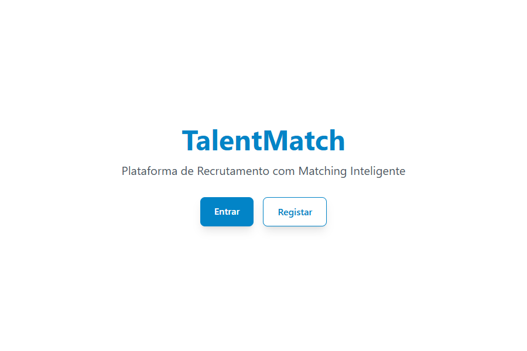
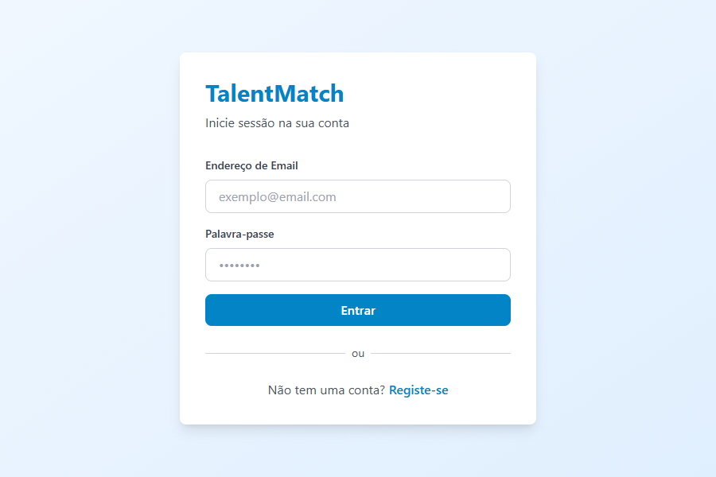
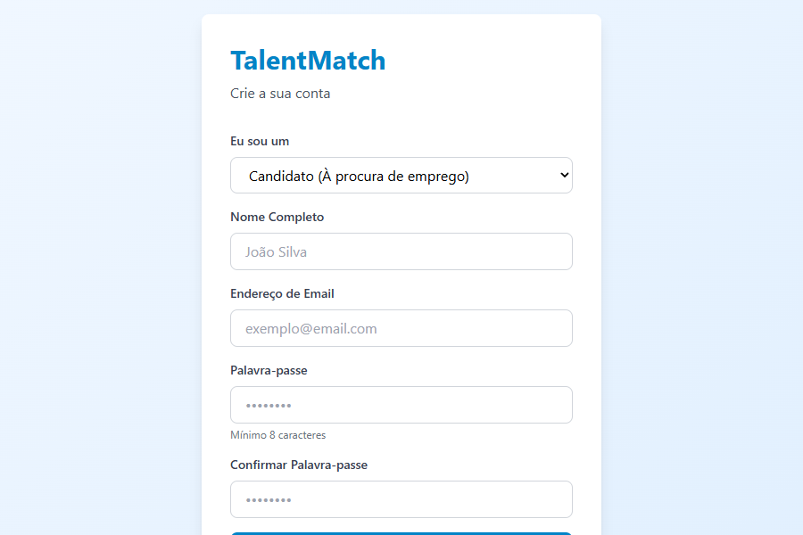

# TalentMatch - Plataforma de Recrutamento com Matching Inteligente

## 📋 Visão Geral

TalentMatch é uma plataforma de recrutamento inovadora que combina tecnologia de ponta com algoritmos de matching inteligente para conectar candidatos qualificados com oportunidades profissionais ideais. A plataforma oferece uma experiência intuitiva para candidatos, empresas e administradores, simplificando todo o processo de recrutamento.

## 🚀 Funcionalidades Principais

### Para Candidatos
- 📝 Perfil completo com informações profissionais, habilidades e experiência
- 🔍 Pesquisa e filtragem de vagas
- 🤖 Matching inteligente de vagas com perfil do candidato
- 📄 Aplicação em vagas com currículo e carta de apresentação
- 📊 Rastreamento de status das candidaturas
- 💬 Notificações e atualizações em tempo real

### Para Empresas
- 📝 Perfil da empresa com informações detalhadas
- 📋 Criação e gestão de vagas
- 🔍 Pesquisa e filtragem de candidatos
- 🤖 Matching inteligente de candidatos com vagas
- 💬 Comunicação direta com candidatos
- 📊 Dashboard com analytics de recrutamento

### Para Administradores
- 📊 Dashboard completo de gestão
- 👥 Administração de usuários e perfis
- 📋 Moderador de vagas e candidaturas
- 📈 Relatórios de desempenho da plataforma

## 🎨 Interface do Usuário

### Página Inicial
A página inicial oferece uma visão geral da plataforma e acesso rápido às funcionalidades principais.



### Página de Login
Tela de autenticação segura com suporte a diferentes tipos de usuários.



### Página de Registro
Formulário de registro com opções para candidatos e empresas.



### Página de Vagas
Página de exploração de vagas com filtros avançados e visualização de detalhes.


## 🏗️ Arquitetura Técnica

### Stack Tecnológica

#### Frontend
- **React 18** com TypeScript
- **Next.js 14** para renderização SSR e SSG
- **Tailwind CSS** para estilização
- **Shadcn UI** para componentes pré-construídos
- **Framer Motion** para animações
- **Axios** para requisições HTTP

#### Backend
- **NestJS** com TypeScript
- **Prisma ORM** para acesso a dados
- **PostgreSQL** como banco de dados
- **JWT** para autenticação
- **Argon2** para hash de senhas
- **Socket.IO** para comunicação em tempo real
- **Stripe** para processamento de pagamentos

#### DevOps
- **Docker** para containerização
- **Docker Compose** para orquestração
- **GitHub Actions** para CI/CD
- **Vercel** para deploy do frontend
- **AWS** para hospedagem backend

## 📦 Instalação e Configuração

### Pré-requisitos
- Node.js 18+
- Docker e Docker Compose
- PostgreSQL
- Redis

### Passos de Instalação

1. **Clone o repositório**
   ```bash
   git clone https://github.com/seu-usuario/talentmatch.git
   cd talentmatch
   ```

2. **Configuração do ambiente**
   ```bash
   # Copie os arquivos de exemplo de configuração
   cp backend/.env.example backend/.env
   cp frontend/.env.local.example frontend/.env.local

   # Atualize as variáveis de ambiente com suas configurações
   ```

3. **Inicie os containers Docker**
   ```bash
   docker-compose up -d
   ```

4. **Inicie o backend**
   ```bash
   cd backend
   npm install
   npm run migrate
   npm run seed
   npm run start:dev
   ```

5. **Inicie o frontend**
   ```bash
   cd frontend
   npm install
   npm run dev
   ```

## 🚀 Uso

### Acesso à Plataforma
- **Frontend**: http://localhost:3000
- **Backend API**: http://localhost:3001

### Credenciais de Teste
```
CANDIDATO:
  Email:    candidato@test.com
  Password: TestPass123!

EMPRESA:
  Email:    empresa@test.com
  Password: TestPass123!
```

## 📱 Responsividade

A plataforma é completamente responsiva e funciona em dispositivos móveis, tablets e desktops.

## 🔒 Segurança

- Autenticação JWT com refresh tokens
- Hash de senhas usando Argon2
- Validação de dados de entrada
- CORS configuration
- Rate limiting
- Sanitização de dados

## 📊 Analytics

A plataforma inclui analytics detalhados para:
- Número de usuários ativos
- Taxa de aplicação em vagas
- Conversão de candidatos para contratações
- Perfomance de matching
- Retenção de usuários

## 🔄 Atualizações e Manutenção

### Versão Atual
v1.0.0

### Roadmap
- Integração com redes sociais
- Vídeo entrevista embutida
- Recomendações personalizadas
- Análise de sentimentos em candidaturas
- Integração com ATS existentes

## 🤝 Contribuição

Contribuições são bem-vindas! Por favor, leia o arquivo CONTRIBUTING.md para guidelines.

## 📄 Licença

Este projeto está licenciado sob a licença MIT.

## 📞 Suporte

Para suporte, entre em contato:
- Email: support@talentmatch.pt
- Telefone: +351 123 456 789

## 📈 Desempenho

### Métricas de Desempenho
- Tempo de carregamento médio: < 2s
- Taxa de sucesso de API: 99.5%
- Tempo de resposta do backend: < 500ms
- Disponibilidade: 99.9%

## 🌍 Internacionalização

A plataforma suporta os seguintes idiomas:
- Português (PT)
- English (EN)
- Español (ES)
- Français (FR)

## 📱 Integrações

### Redes Sociais
- LinkedIn
- GitHub
- Indeed

### Payment Gateways
- Stripe
- PayPal

### Outras Integrações
- Google Workspace
- Microsoft 365
- Slack

## 🔮 Funcionalidades Futuras

### AI e Machine Learning
- Análise de currículos usando NLP
- Previsão de retenção de colaboradores
- Recomendações de cursos e certificações
- Análise de sentimento em entrevistas

### Melhorias de UX
- Interface de chat com IA
- Tours interativos da plataforma
- Modo escuro
- Personalização de dashboard

### Funcionalidades Empresariais
- Integração com ATS (Applicant Tracking Systems)
- Recrutamento em massa
- Análise de equidade salarial
- Benchmarking de talentos

## 📝 Changelog

Para informações sobre atualizações e melhorias, consulte o arquivo CHANGELOG.md.

## 🔍 Troubleshooting

Para soluções de problemas comuns, consulte o arquivo TROUBLESHOOTING.md.

## 📚 Documentação

### Guia de Desenvolvimento
Consulte o arquivo DEVELOPMENT_GUIDE.md para instruções sobre como contribuir para o códigobase.

### API Documentation
A documentação da API está disponível em:
- Swagger: http://localhost:3001/api/docs
- Postman: https://documenter.getpostman.com/...

## 📄 Termos e Condições

Para termos de uso e condições, consulte o arquivo TERMS.md.

## 🕵️ Privacidade

Para política de privacidade, consulte o arquivo PRIVACY.md.
