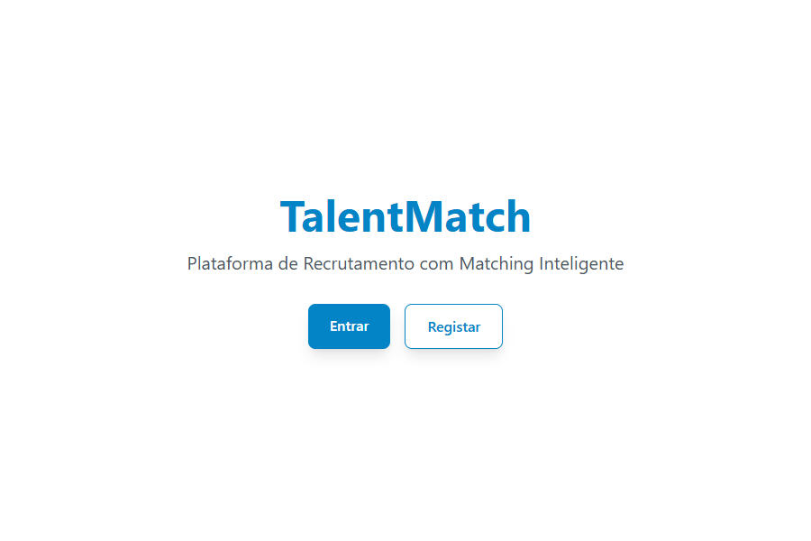
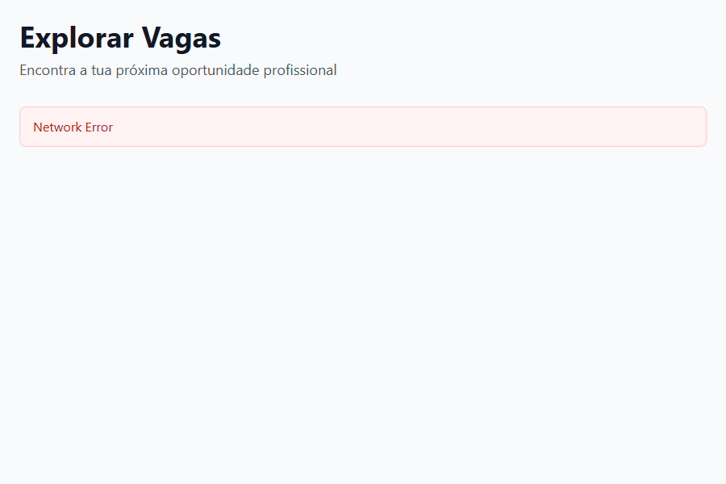
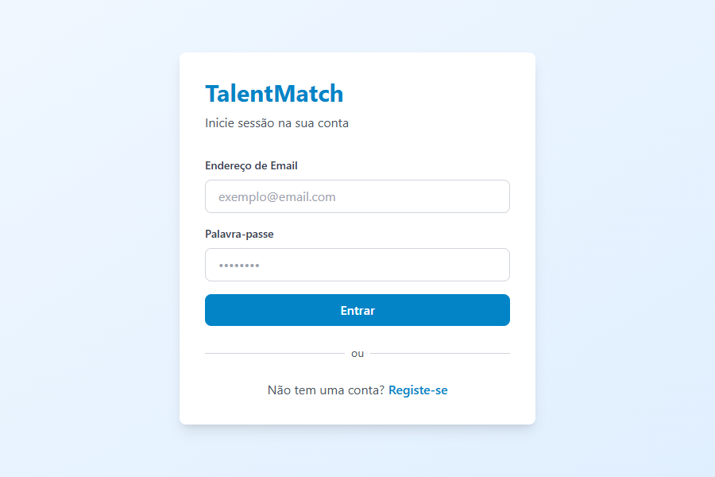

# 🚀 TalentMatch - Plataforma de Recrutamento Inteligente

[](https://nestjs.com/)
[](https://nextjs.org/)
[](https://www.prisma.io/)
[](https://www.postgresql.org/)
[](https://openai.com/)
[](https://stripe.com/)

O **TalentMatch** é uma solução de recrutamento de nível empresarial (enterprise-grade) que utiliza Inteligência Artificial avançada para conectar talentos a oportunidades. O sistema apresenta um algoritmo de matching híbrido, videochamadas integradas e suporte multi-tenant com personalização de marca.

## 🎯 Objetivos do Projeto

O TalentMatch foi desenvolvido para resolver a ineficiência nos processos de recrutamento tradicionais, proporcionando:
- **Precisão**: Matching automático baseado em competências técnicas e afinidade semântica.
- **Agilidade**: Ferramentas de comunicação direta (Chat/Vídeo) integradas.
- **Escalabilidade**: Arquitetura modular pronta para suportar milhares de utilizadores e empresas.
- **Customização**: Experiência personalizada para empresas Enterprise (White-label).

---

## ✨ Funcionalidades

### ✅ Implementadas
- **Autenticação Robusta**: Sistema JWT com Refresh Tokens e RBAC (Candidato, Empresa, Admin).
- **Matching Híbrido (IA)**: Algoritmo que combina critérios determinísticos (skills, localização, salário) com análise semântica via OpenAI Embeddings.
- **Gestão de Vagas**: Fluxo completo de criação, edição e publicação de oportunidades.
- **Candidaturas Inteligentes**: Dashboard para candidatos gerirem aplicações e para empresas triarem talentos por score.
- **Chat em Tempo Real**: Comunicação direta via Socket.io com persistência em base de dados.
- **Video-Entrevistas**: Chamadas de vídeo integradas no chat via WebRTC (Simple-Peer).
- **Sistema de Faturação**: Integração com Stripe para planos Free, Pro e Enterprise.
- **Multi-Tenant & Branding**: Personalização dinâmica de cores e logos por empresa.
- **Dashboard Admin**: Monitorização global de métricas, utilizadores e vagas.
- **Multi-idioma**: Suporte para Português (PT-PT), Inglês, Espanhol e Francês.

### ⏳ Em Falta / Planeadas (Roadmap)
- **Migração pgvector**: Otimização da pesquisa vetorial diretamente na base de dados.
- **AI Interview Assistant**: Pré-triagem automatizada via IA com análise de sentimento.
- **App Mobile**: Versão nativa em React Native para notificações push em tempo real.
- **Gamificação**: Sistema de medalhas e desafios técnicos para candidatos.
- **Templates de Email**: Design refinado para notificações transacionais via Resend.

---

## 🛠️ Stack Tecnológica

### Backend (API)
- **Framework**: NestJS (Node.js)
- **Linguagem**: TypeScript
- **ORM**: Prisma
- **Base de Dados**: PostgreSQL + Redis (Caching)
- **IA**: OpenAI API (text-embedding-3-small, GPT-4)
- **Comunicação**: Socket.io (WebSocket), Resend (Emails)
- **Pagamentos**: Stripe SDK

### Frontend (Web)
- **Framework**: Next.js 14 (App Router)
- **Estilização**: Tailwind CSS + Framer Motion
- **Estado**: TanStack Query + Zustand
- **Gráficos**: Recharts
- **WebRTC**: Simple-Peer
- **i18n**: Custom I18nProvider

---

## 📁 Estrutura de Pastas

```text
/talentmatch
├── backend/                # API NestJS
│   ├── prisma/             # Schema e Migrações
│   ├── src/
│   │   ├── modules/        # Domínios (Auth, Matching, Billing, etc.)
│   │   ├── common/         # Decoradores, Guards, Interceptores
│   │   └── database/       # Conexão Prisma
├── frontend/               # App Next.js
│   ├── messages/           # Arquivos de tradução (JSON)
│   ├── src/
│   │   ├── app/            # Páginas e Rotas (App Router)
│   │   ├── components/     # UI Components
│   │   ├── providers/      # Contextos (Auth, Branding, I18n)
│   │   └── services/       # Clientes de API (Axios)
└── docs/                   # Documentação Técnica Detalhada
```

---

## ⚙️ Instalação e Execução

### Pré-requisitos
- Node.js 20+
- Docker & Docker Compose

### Configuração
1. Clone o repositório.
2. Configure os ficheiros .env (backend e frontend).

### Execução via Docker (Recomendado)
```bash
docker-compose up -d
```

### Execução Local (Desenvolvimento)
Consulte os arquivos README.md individuais em cada pasta para comandos de inicialização (npm r-u-n d-e-v / n-p-m s-t-a-r-t).

---

## 🔍 Explicação Técnica: O Coração do Sistema

### 1. Matching Híbrido
O score de 0 a 100 é calculado da seguinte forma:
- **60% Determinístico**: Comparação direta de skills (exatas e similares), localização (remoto vs presencial), nível de senioridade e expectativa salarial.
- **40% Semântico**: Utiliza embeddings da OpenAI para entender o contexto do CV e da descrição da vaga, calculando a similaridade de cosseno.

### 2. Branding Dinâmico
Utilizamos CSS Variables (--dynamic-primary) injetadas via BrandingProvider. Quando uma empresa Enterprise faz login, o sistema carrega as suas cores e logo da base de dados e aplica-as globalmente na interface.

### 3. WebRTC Signaling
O chat utiliza Socket.io para trocar os "signals" do WebRTC. Uma vez estabelecida a ligação P2P através do simple-peer, o tráfego de vídeo e áudio não passa pelo servidor, garantindo privacidade e baixa latência.

---

## 🖼️ Documentação Visual

### Homepage


### Fluxo de Vagas


### Dashboard de Gestão


---

## ⚠️ Problemas Conhecidos e Melhorias

| Severidade | Problema | Impacto | Recomendação |
| :--- | :--- | :--- | :--- |
| **Importante** | Similaridade Semântica em JS | Performance em larga escala | Migrar para **pgvector** no PostgreSQL. |
| **Moderado** | Dados Admin Mockados | Gráficos do admin não são 100% reais | Implementar queries agregadas no Prisma. |
| **Moderado** | Falta Rate Limiting | Vulnerabilidade a brute-force | Implementar @nestjs/throttler. |
| **Cosmético** | Unused next-intl | Peso extra nas dependências | Remover next-intl e consolidar o I18nProvider. |

---

## 🗺️ Roadmap Sugerido

1. **Sprint 1: Infraestrutura & Segurança**
   - Implementar Rate Limiting.
   - Migrar embeddings para pgvector.
2. **Sprint 2: Analytics Real**
   - Substituir mock data do Admin por queries reais.
   - Adicionar exportação de relatórios em PDF.
3. **Sprint 3: AI Expansion**
   - Iniciar o AI Interview Assistant.
   - Refinar templates de e-mail transacionais.

---
*Documento gerado como parte da Auditoria Técnica - Fevereiro 2026*
